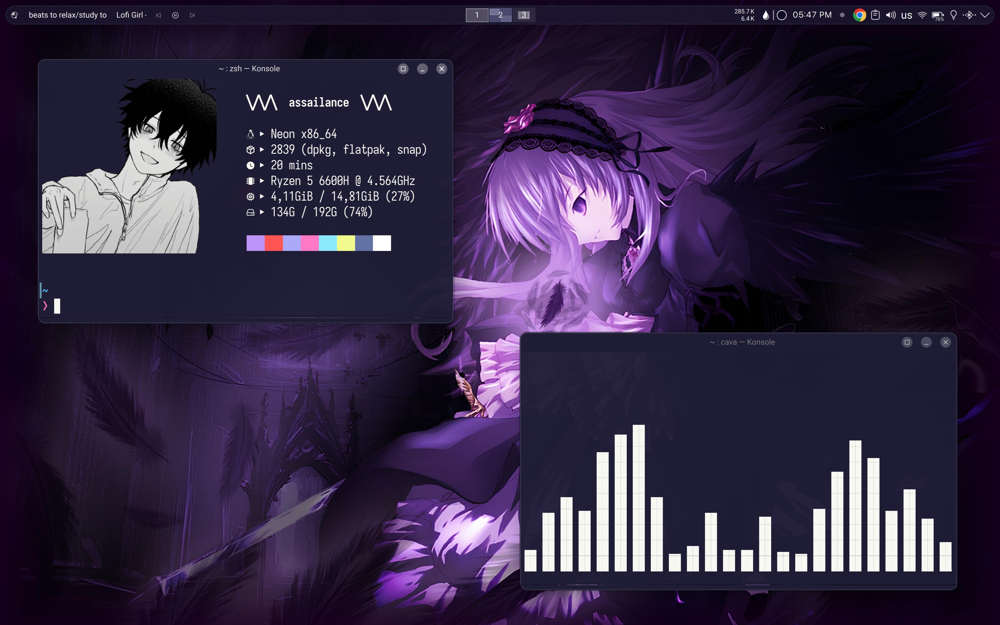

  <h1>KDE Plasma Appearance</h1>
  
  
   
  

***

<table align="center">
  <tr>
    <td colspan="4"></td>
  </tr>
  <tr>
    <td colspan="1"></td>
    <td colspan="1"></td>
  </tr>
  <tr>
    <td colspan="4"></td>
  </tr>
</table>

# Appearance

## 🎨 Global Themes

- Black: ⚫ [Nothing](https://gitlab.com/jomada/nothing) by [jomada](https://gitlab.com/jomada)
- Purple: 🟣 [Jolly-Plasma-Themes](https://github.com/L4ki/Jolly-Plasma-Themes) by [L4ki](https://github.com/L4ki)
- White: ⚪ [Moe-Theme](https://gitlab.com/jomada/moe-theme) by [jomada](https://gitlab.com/jomada)
- Green: 🟢 [Gently](https://github.com/L4ki/Gently) by [L4ki](https://github.com/L4ki)

## 📁 Icons

- [Colloid](https://github.com/vinceliuice/Colloid-icon-theme) by [vinceliuice](https://github.com/vinceliuice)
- [Reversal](https://github.com/yeyushengfan258/Reversal-icon-theme) by [yeyushengfan258](https://github.com/yeyushengfan258)
- [Tela](https://github.com/vinceliuice/Tela-icon-theme) by [vinceliuice](https://github.com/vinceliuice)
- [Flat-Remix](https://github.com/daniruiz/Flat-Remix) by [daniruiz](https://github.com/daniruiz)
- [WhiteSur](https://github.com/vinceliuice/WhiteSur-icon-theme) by [vinceliuice](https://github.com/vinceliuice)

## 📱 Plasma Widgets

- [Plasma-Applet-Netspeed](https://github.com/dfaust/plasma-applet-netspeed-widget) by [dfaust](https://github.com/dfaust)
- [Plasmusic-Toolbar](https://github.com/ccatterina/plasmusic-toolbar) by [ccatterina](https://github.com/ccatterina)

## Additional Windows Decorations

- [ketsa](https://store.kde.org/p/1969727/) by [zayronXIO](https://store.kde.org/u/zayronXIO)
- [KdeWaita Dark](https://store.kde.org/p/2271791/) by [zayronXIO](https://store.kde.org/u/zayronXIO)

***

> [!WARNING]
> FILES UPLOADED TO THE REPOSITORY MAY BE OUT OF DATE.
> PLEASE DOWNLOAD THE LATEST VERSIONS FROM THE OFFICIAL SOURCES MENTIONED HERE.

## 🛠 Folders to Installation

-   Colours: `~/.local/share/color-schemes`
-   Application Style: `~/.themes`
-   Plasma Style: `~/.local/share/plasma/desktoptheme`
-   Window Decorations: `~/.local/share/aurorae/themes`
-   Icons: `~/.local/share/icons`
-   Cursors: `~/.icons`
-   Splash Screen: `~/.local/share/plasma/look-and-feel`
-   Terminal: `~/.local/share/konsole`
